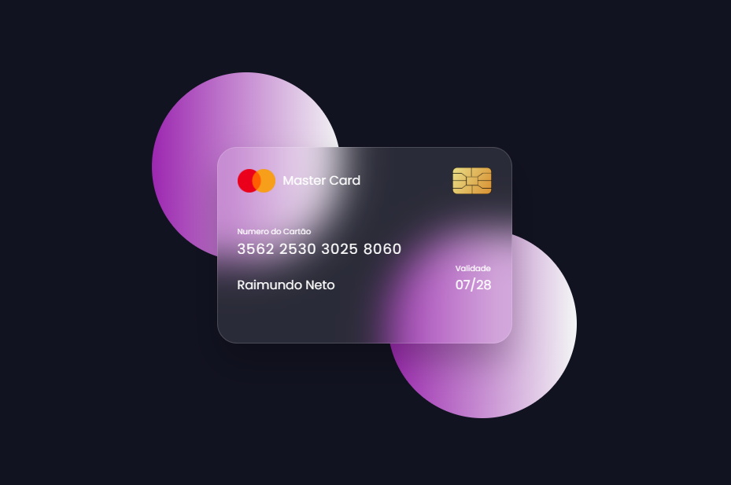

# 💳 Cartão de Crédito Interativo com CSS

Este projeto apresenta um modelo de cartão de crédito com efeito de rotação 3D, desenvolvido com **HTML** e **CSS puro**. Ao passar o mouse sobre o cartão, ele gira revelando o verso, simulando uma experiência visual moderna e responsiva.

> ⚠️ Este projeto foi desenvolvido com fins educacionais como parte de um curso. O código foi baseado em tutoriais públicos e adaptado para prática pessoal.

## ✨ Funcionalidades

- Efeito de rotação 3D com `transform: rotateY`
- Estilo glassmorphism com `backdrop-filter`
- Design responsivo para dispositivos móveis
- Animações suaves e gradientes modernos
- Fonte personalizada via Google Fonts (Poppins)

## 📱 Responsividade

O layout foi ajustado para funcionar bem em telas menores. O problema de barra branca em dispositivos móveis foi resolvido com `overflow: hidden` na section principal.

## 🛠️ Tecnologias Utilizadas

- HTML5
- CSS3
- Google Fonts

## 📷 Preview




## 📚 Créditos e Referência

Este projeto foi baseado no tutorial do canal [CodingLab](https://www.youtube.com/@CodingLabYT):

🔗 [Flipping Card UI Design in HTML & CSS | Card Hover Animation | ASMR programming](https://youtu.be/20Qb7pNMv-4?si=qKo50X6i3JJFHYVE)

A estrutura, estilo e animações foram inspiradas na aula, com adaptações feitas durante o processo de aprendizado.

## 🚀 Como Usar

1. Clone o repositório:
   ```bash
   git clone https://github.com/seu-usuario/nome-do-repositorio.git
